# 🤖 InfluencerBot - תיעוד מערכת מלא

## 📋 תוכן עניינים
1. [סקירה כללית](#סקירה-כללית)
2. [ארכיטקטורה](#ארכיטקטורה)
3. [מודלים ו-Types](#מודלים-ו-types)
4. [זרימות עיקריות](#זרימות-עיקריות)
5. [API Endpoints](#api-endpoints)
6. [דף הצ'אט](#דף-הצאט)
7. [פאנל המשפיען](#פאנל-המשפיען)
8. [סריקת אינסטגרם](#סריקת-אינסטגרם)
9. [אינטגרציות](#אינטגרציות)
10. [מסד הנתונים](#מסד-הנתונים)
11. [משתני סביבה](#משתני-סביבה)

---

## סקירה כללית

**InfluencerBot** היא פלטפורמה ליצירת צ'אטבוטים מותאמים אישית למשפיענים.

### יכולות עיקריות:
- 🔍 סריקה אוטומטית של פרופיל אינסטגרם
- 🧠 יצירת פרסונה AI דינמית על בסיס התוכן
- 💬 צ'אטבוט חכם עם OpenAI Responses API
- 🎁 ניהול מותגים וקופונים
- 📞 מערכת תמיכה עם התראות WhatsApp
- 📊 אנליטיקס ומעקב שיחות
- 🎨 עיצוב מותאם אישית (themes)

### טכנולוגיות:
- **Frontend:** Next.js 16.1, React 19, Tailwind CSS 4, Framer Motion
- **Backend:** Next.js API Routes
- **Database:** Supabase (PostgreSQL)
- **AI:** OpenAI Responses API (gpt-5-nano, gpt-5)
- **Instagram Scraping:** Apify
- **WhatsApp:** GREEN-API

---

## ארכיטקטורה

### תרשים ארכיטקטורה כללי

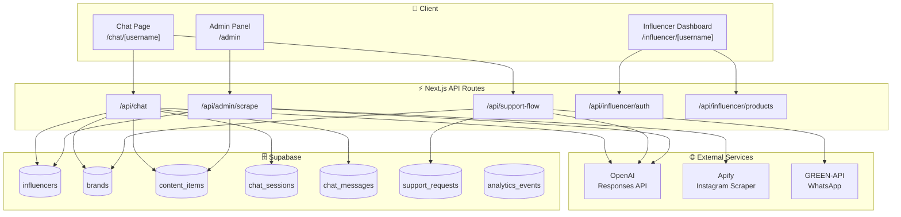

### מבנה תיקיות

```
src/
├── app/                          # Next.js App Router
│   ├── api/                      # API Routes
│   │   ├── admin/               
│   │   │   ├── scrape/route.ts   # סריקת אינסטגרם
│   │   │   ├── influencers/      # CRUD משפיענים
│   │   │   └── products/         # CRUD מוצרים
│   │   ├── chat/route.ts         # API צ'אט ראשי
│   │   ├── support-flow/route.ts # תהליך תמיכה
│   │   └── influencer/
│   │       ├── auth/route.ts     # התחברות משפיען
│   │       └── rescan/route.ts   # סריקה מחדש
│   ├── chat/[username]/          # דף הצ'אטבוט
│   ├── influencer/[username]/    # דשבורד משפיען
│   │   ├── dashboard/
│   │   ├── brands/
│   │   ├── content/
│   │   ├── analytics/
│   │   ├── conversations/
│   │   ├── settings/
│   │   └── support/
│   └── admin/                    # פאנל אדמין
├── components/
│   ├── chat/
│   │   ├── BrandCards.tsx        # כרטיסיות מותגים
│   │   └── SupportFlowForm.tsx   # טופס תמיכה
│   └── wizard/                   # אשף הוספת משפיען
├── lib/
│   ├── openai.ts                 # אינטגרציית OpenAI
│   ├── supabase.ts               # פונקציות DB
│   ├── apify.ts                  # סריקת אינסטגרם
│   ├── whatsapp.ts               # שליחת WhatsApp
│   └── theme.ts                  # ניהול עיצוב
└── types/
    └── index.ts                  # TypeScript Types
```

---

## מודלים ו-Types

### תרשים ER - מסד הנתונים

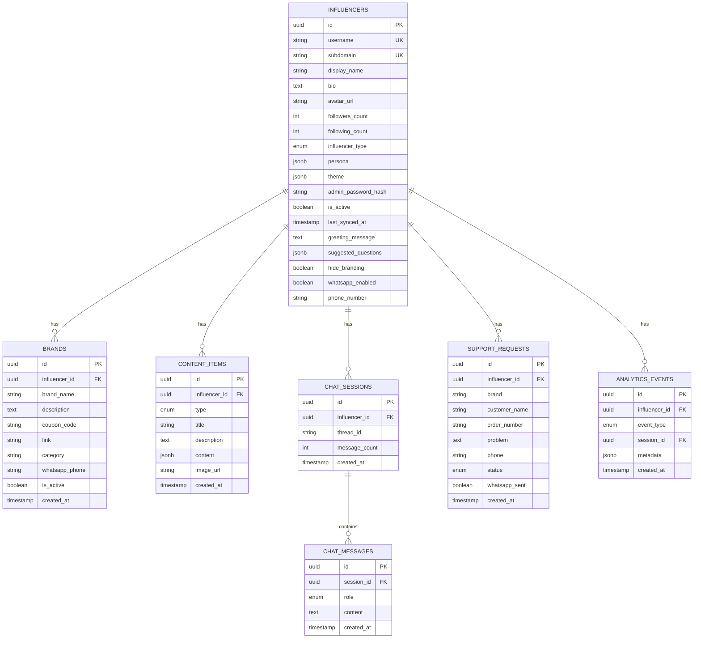

### Types עיקריים

```typescript
// סוג משפיען
type InfluencerType = 
  | 'food' | 'fashion' | 'tech' | 'lifestyle' 
  | 'fitness' | 'beauty' | 'parenting' | 'travel' | 'other';

// פרסונה (נוצרת אוטומטית מהתוכן)
interface InfluencerPersona {
  tone: string;              // "חם", "מקצועי", "משעשע"
  style: string;             // "קליל", "ידידותי", "מעורר השראה"
  interests: string[];       // תחומי עניין
  signature_phrases: string[]; // ביטויים אופייניים
  emoji_style: 'none' | 'minimal' | 'frequent';
  language: 'he' | 'en' | 'mixed';
}

// סוגי תוכן דינמיים
type ContentItemType = 
  | 'recipe' | 'review' | 'recommendation'  // Food
  | 'look' | 'outfit' | 'style_tip'        // Fashion
  | 'tutorial' | 'routine'                  // Beauty
  | 'tip' | 'moment' | 'story'             // Lifestyle
  | 'workout' | 'motivation'               // Fitness
  | 'collaboration' | 'event' | 'unboxing' | 'itinerary';

// מותג/שיתוף פעולה
interface Brand {
  id: string;
  influencer_id: string;
  brand_name: string;
  description: string | null;
  coupon_code: string | null;
  link: string | null;
  category: string | null;
  whatsapp_phone: string | null;
  is_active: boolean;
}
```

---

## זרימות עיקריות

### 1. זרימת צ'אט רגיל

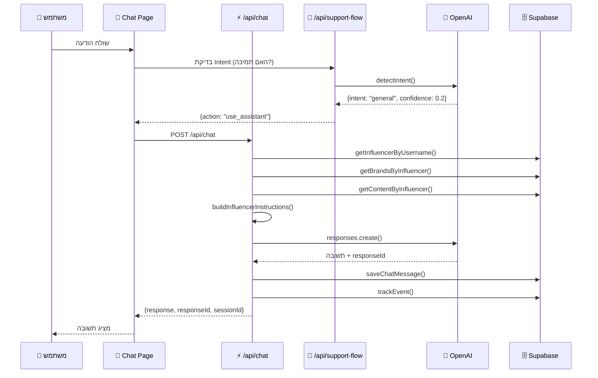

### 2. זרימת תמיכה (Support Flow)

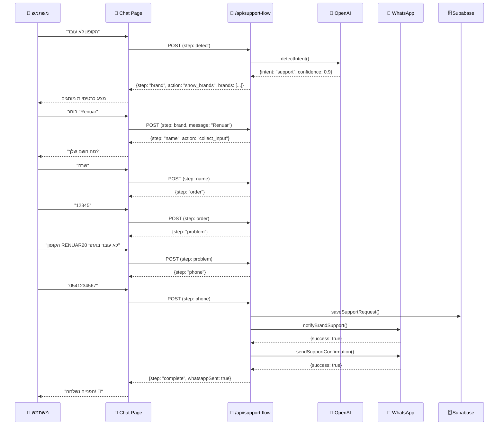

### 3. זרימת סריקה (Admin Scrape)

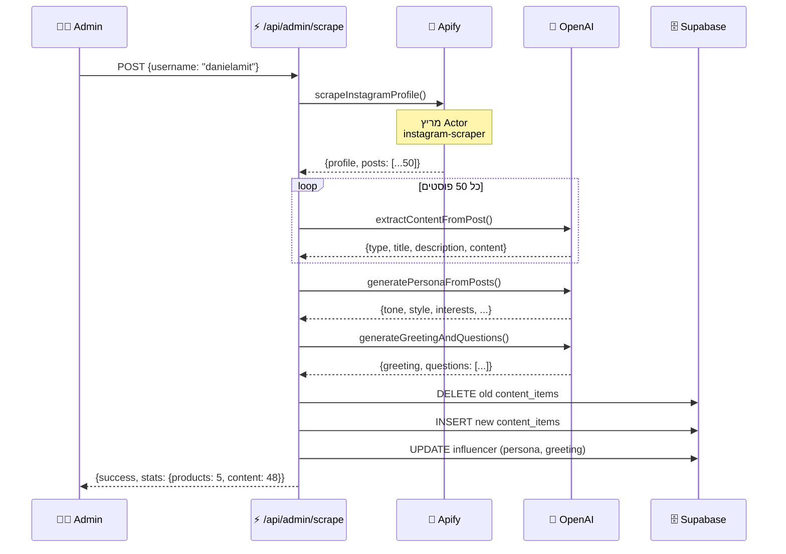

---

## API Endpoints

### 🔐 Authentication

| Endpoint | Method | תיאור |
|----------|--------|-------|
| `/api/influencer/auth` | GET | בדיקת התחברות משפיען |
| `/api/influencer/auth` | POST | התחברות/התנתקות |
| `/api/admin` | POST | התחברות אדמין |

### 💬 Chat

| Endpoint | Method | תיאור |
|----------|--------|-------|
| `/api/chat` | POST | שליחת הודעה לצ'אטבוט |
| `/api/support-flow` | POST | טיפול בפניות תמיכה |
| `/api/support` | POST | שליחת פנייה ישירה |

### 📊 Admin

| Endpoint | Method | תיאור |
|----------|--------|-------|
| `/api/admin/scrape` | POST | סריקת אינסטגרם מלאה |
| `/api/admin/influencers` | GET/POST | רשימת/יצירת משפיענים |
| `/api/admin/products` | GET/POST/PUT/DELETE | CRUD מוצרים |
| `/api/admin/content` | GET | רשימת תוכן |

### 🔧 Influencer Management

| Endpoint | Method | תיאור |
|----------|--------|-------|
| `/api/influencer/rescan` | POST | סריקה מחדש |
| `/api/influencer/products` | GET/POST/PUT/DELETE | ניהול מותגים |
| `/api/influencer/content` | GET | תוכן המשפיען |
| `/api/influencer/regenerate-greeting` | POST | יצירת ברכה מחדש |

---

## דף הצ'אט

### מבנה הקומפוננטה

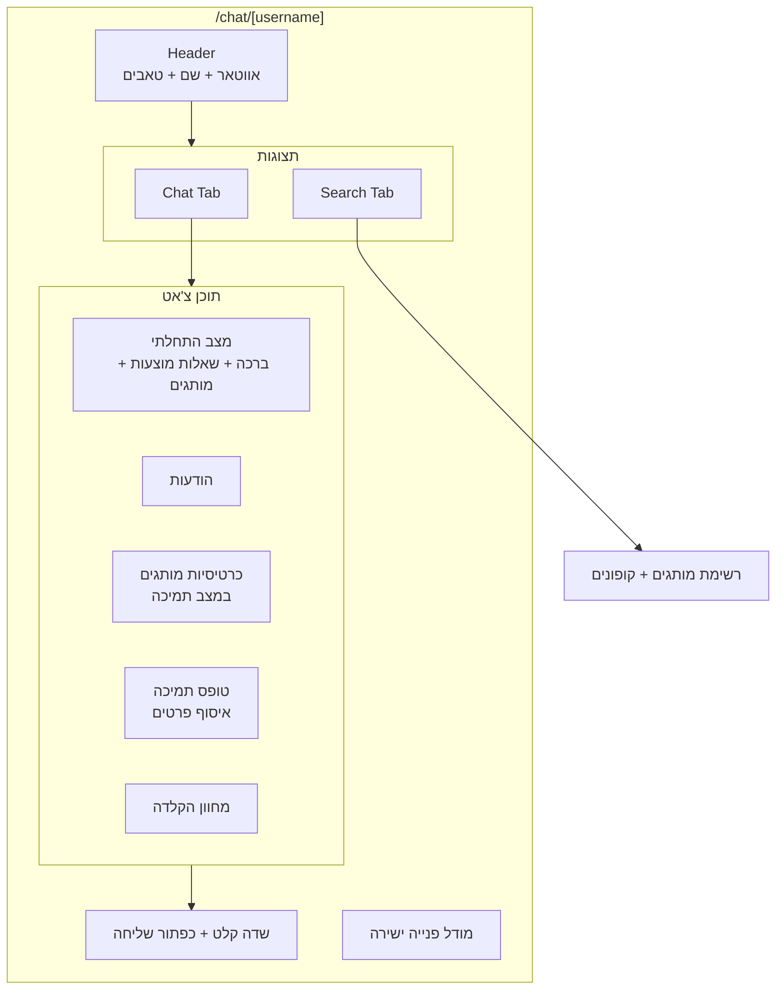

### States

```typescript
// מצב תמיכה
interface SupportState {
  step: 'detect' | 'brand' | 'name' | 'order' | 'problem' | 'phone' | 'complete';
  data: {
    brand?: string;
    customerName?: string;
    orderNumber?: string;
    problemDetails?: string;
    customerPhone?: string;
  };
}

// הודעה
interface Message {
  id: string;
  role: 'user' | 'assistant';
  content: string;
  action?: 'show_brands' | 'collect_input' | 'complete';
  brands?: BrandInfo[];
  inputType?: 'name' | 'order' | 'problem' | 'phone';
}
```

---

## פאנל המשפיען

### מפת ניווט

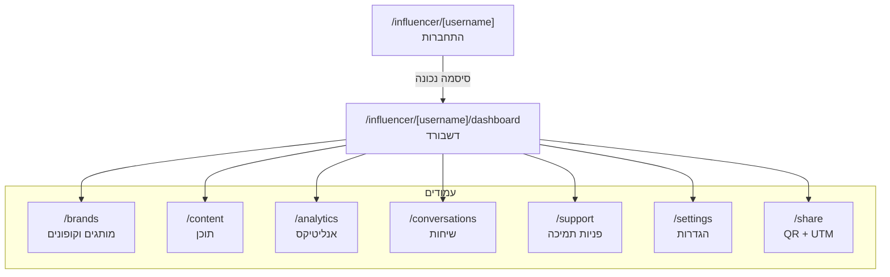

### יכולות בכל עמוד

| עמוד | יכולות |
|------|--------|
| **Dashboard** | סטטיסטיקות, קישור לצ'אטבוט, סריקה מחדש |
| **Brands** | הוספה/עריכה/מחיקה של מותגים וקופונים |
| **Content** | צפייה בתוכן שנשלף מאינסטגרם |
| **Analytics** | גרפים, טופ מוצרים, פעילות יומית |
| **Conversations** | צפייה בשיחות, חיפוש |
| **Support** | ניהול פניות תמיכה |
| **Settings** | עריכת פרסונה, עיצוב, WhatsApp |
| **Share** | QR Code, לינקים עם UTM |

---

## סריקת אינסטגרם

### תהליך הסריקה

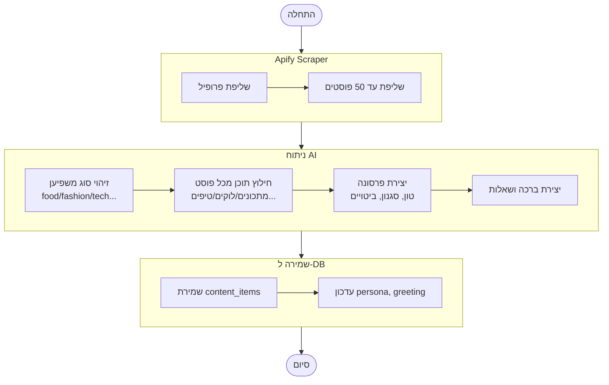

### סוגי תוכן לפי סוג משפיען

| סוג משפיען | סוגי תוכן |
|-----------|----------|
| **Food** | recipe, review, tip, recommendation |
| **Fashion** | look, outfit, collaboration, style_tip, event |
| **Beauty** | tutorial, review, tip, look, routine |
| **Lifestyle** | tip, moment, review, recommendation, story |
| **Fitness** | workout, tip, routine, motivation, recipe |
| **Parenting** | tip, story, recommendation, moment, review |
| **Tech** | review, tutorial, tip, unboxing |
| **Travel** | review, tip, recommendation, story, itinerary |

---

## אינטגרציות

### OpenAI - Responses API

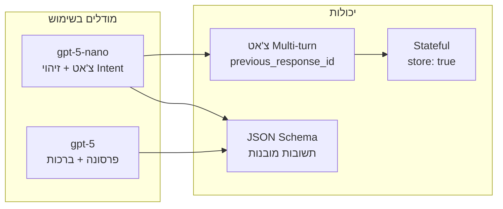

### WhatsApp - GREEN-API

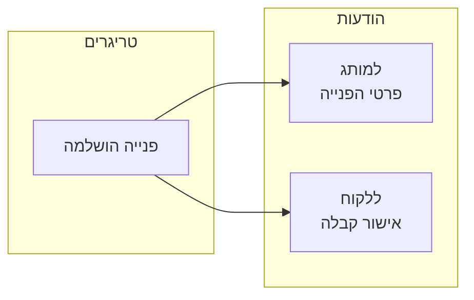

### Apify - Instagram Scraper

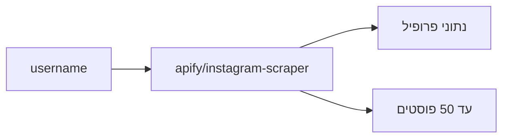

---

## מסד הנתונים

### טבלאות עיקריות

```sql
-- משפיענים
CREATE TABLE influencers (
  id UUID PRIMARY KEY DEFAULT gen_random_uuid(),
  username VARCHAR UNIQUE NOT NULL,
  subdomain VARCHAR UNIQUE NOT NULL,
  display_name VARCHAR NOT NULL,
  bio TEXT,
  avatar_url VARCHAR,
  followers_count INTEGER DEFAULT 0,
  influencer_type VARCHAR DEFAULT 'other',
  persona JSONB,
  theme JSONB NOT NULL,
  admin_password_hash VARCHAR NOT NULL,
  is_active BOOLEAN DEFAULT true,
  greeting_message TEXT,
  suggested_questions JSONB DEFAULT '[]',
  whatsapp_enabled BOOLEAN DEFAULT false,
  phone_number VARCHAR,
  created_at TIMESTAMPTZ DEFAULT now(),
  updated_at TIMESTAMPTZ DEFAULT now()
);

-- מותגים
CREATE TABLE brands (
  id UUID PRIMARY KEY DEFAULT gen_random_uuid(),
  influencer_id UUID REFERENCES influencers(id),
  brand_name VARCHAR NOT NULL,
  description TEXT,
  coupon_code VARCHAR,
  link VARCHAR,
  category VARCHAR,
  whatsapp_phone VARCHAR,
  is_active BOOLEAN DEFAULT true,
  created_at TIMESTAMPTZ DEFAULT now(),
  updated_at TIMESTAMPTZ DEFAULT now()
);

-- פריטי תוכן
CREATE TABLE content_items (
  id UUID PRIMARY KEY DEFAULT gen_random_uuid(),
  influencer_id UUID REFERENCES influencers(id),
  type VARCHAR NOT NULL,
  title VARCHAR NOT NULL,
  description TEXT,
  content JSONB DEFAULT '{}',
  image_url VARCHAR,
  created_at TIMESTAMPTZ DEFAULT now()
);

-- פניות תמיכה
CREATE TABLE support_requests (
  id UUID PRIMARY KEY DEFAULT gen_random_uuid(),
  influencer_id UUID REFERENCES influencers(id),
  brand VARCHAR NOT NULL,
  customer_name VARCHAR NOT NULL,
  order_number VARCHAR,
  problem TEXT NOT NULL,
  phone VARCHAR NOT NULL,
  status VARCHAR DEFAULT 'open',
  whatsapp_sent BOOLEAN DEFAULT false,
  created_at TIMESTAMPTZ DEFAULT now(),
  resolved_at TIMESTAMPTZ
);
```

### RLS Policies

```sql
-- לדוגמה: גישה ציבורית לטבלאות צ'אט
ALTER TABLE chat_sessions ENABLE ROW LEVEL SECURITY;
CREATE POLICY "Public insert" ON chat_sessions FOR INSERT WITH CHECK (true);
CREATE POLICY "Public select" ON chat_sessions FOR SELECT USING (true);
CREATE POLICY "Public update" ON chat_sessions FOR UPDATE USING (true);
```

---

## משתני סביבה

```bash
# Supabase
NEXT_PUBLIC_SUPABASE_URL=https://xxx.supabase.co
NEXT_PUBLIC_SUPABASE_ANON_KEY=eyJ...
SUPABASE_SERVICE_ROLE_KEY=eyJ...

# OpenAI
OPENAI_API_KEY=sk-...

# Apify
APIFY_TOKEN=apify_api_...

# GREEN-API (WhatsApp)
GREEN_API_INSTANCE_ID=1234567890
GREEN_API_TOKEN=...

# Admin
ADMIN_PASSWORD=your_admin_password
```

---

## סיכום

InfluencerBot היא מערכת מלאה לניהול צ'אטבוטים למשפיענים, הכוללת:

1. **סריקה אוטומטית** - Apify מביא את התוכן, AI מנתח ויוצר פרסונה
2. **צ'אט חכם** - OpenAI Responses API עם זיכרון שיחה
3. **תמיכה משולבת** - זיהוי אוטומטי + תהליך מובנה + WhatsApp
4. **דשבורד מלא** - ניהול מותגים, תוכן, אנליטיקס

### קישורים חשובים

- **Vercel:** הפרויקט מופעל ב-Vercel
- **Supabase:** ניהול DB ואותנטיקציה
- **OpenAI:** Responses API (gpt-5-nano / gpt-5)
- **Apify:** סריקת אינסטגרם
- **GREEN-API:** WhatsApp Integration

---

*תיעוד זה נוצר אוטומטית ומייצג את מצב המערכת נכון ל-2026.*


