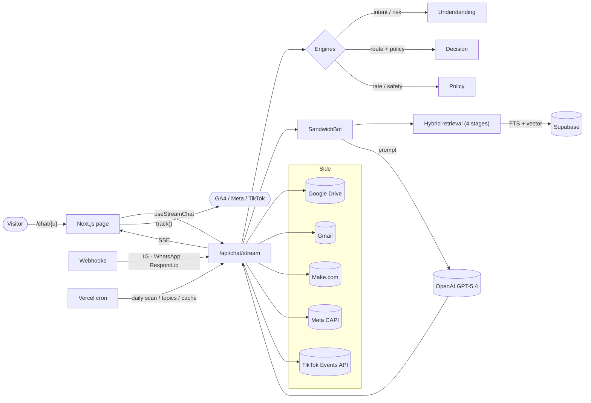
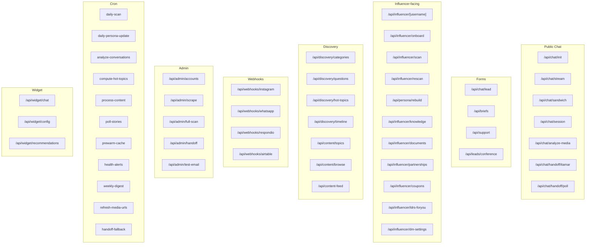
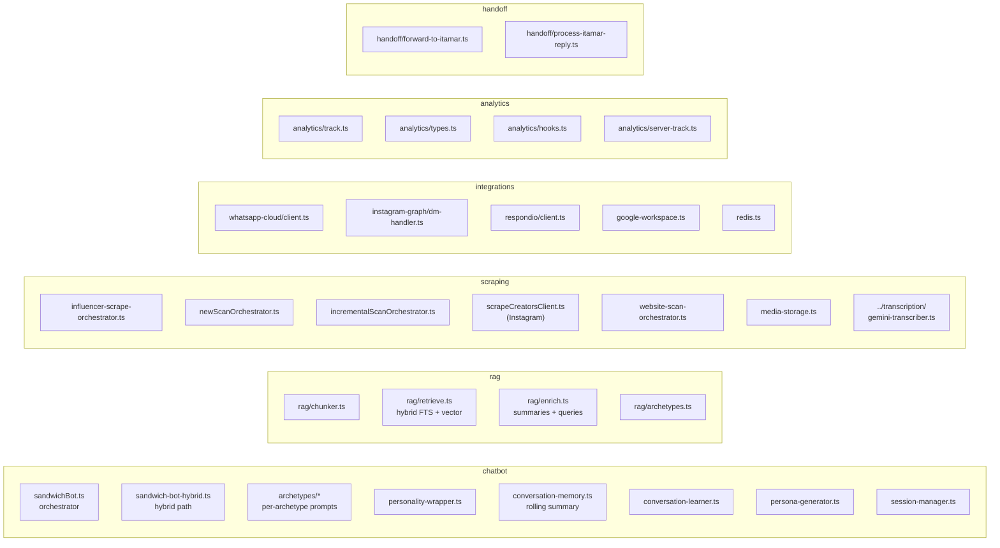
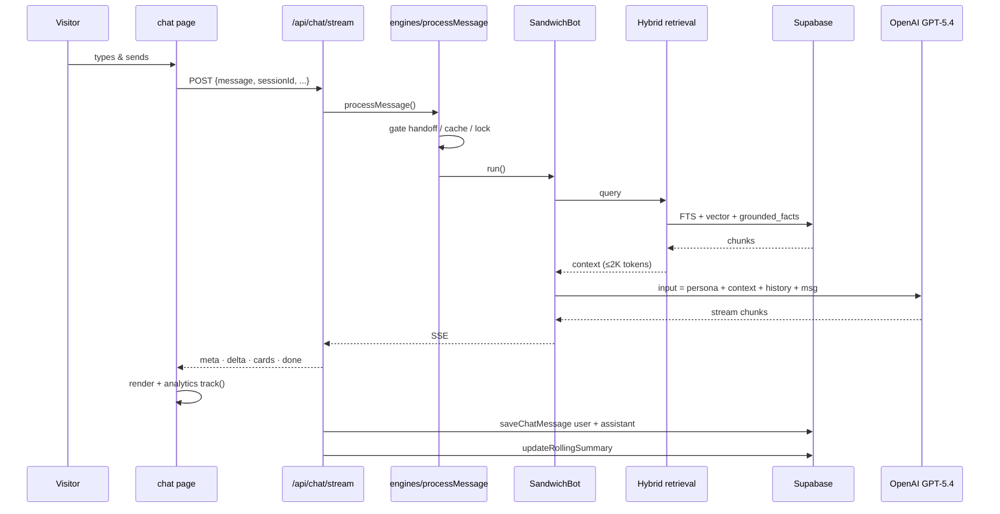
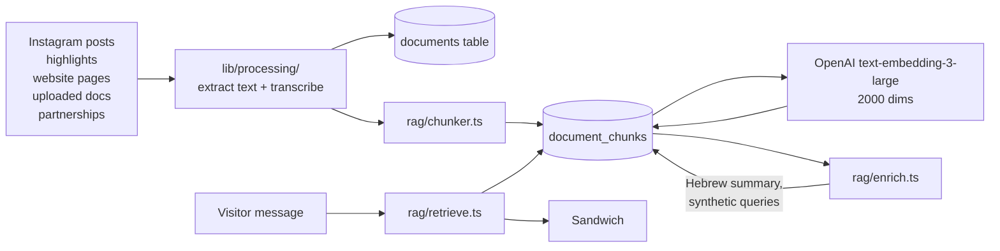
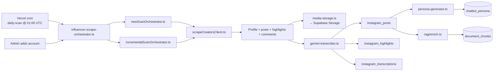
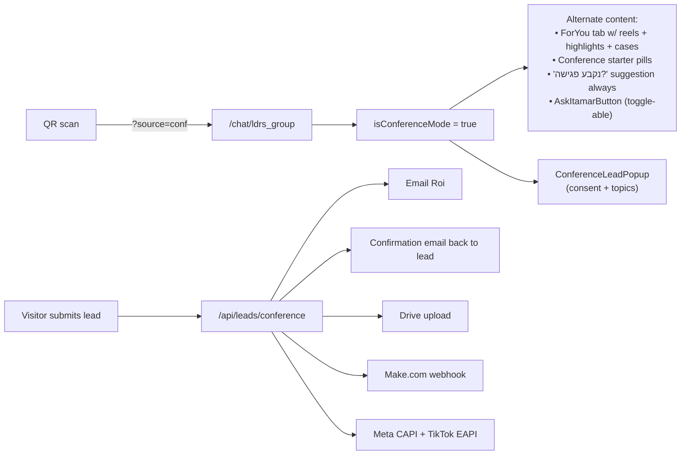
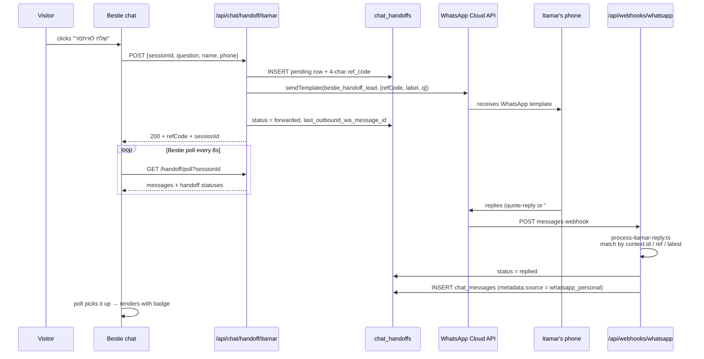
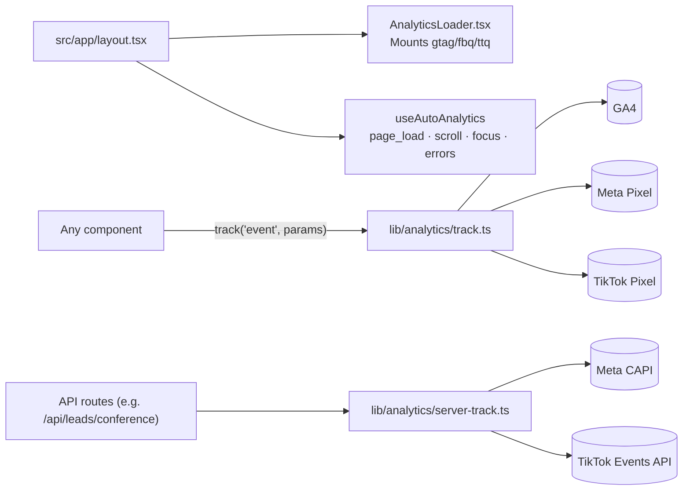

# Bestie · Developer Guide

> The complete map of the codebase. Use this to onboard a new engineer
> in a day, audit a section before changing it, or hand off the project.
> Everything is grouped by concern with file-level descriptions and
> Mermaid diagrams. Last updated: **2026-04-28**.

---

## Table of contents

1. [What this product is](#1--what-this-product-is)
2. [Tech stack](#2--tech-stack)
3. [Repo layout (top-level)](#3--repo-layout-top-level)
4. [High-level architecture](#4--high-level-architecture)
5. [Account types & archetypes](#5--account-types--archetypes)
6. [Pages & routes](#6--pages--routes)
7. [API surface](#7--api-surface)
8. [Components catalog](#8--components-catalog)
9. [Library catalog (`src/lib`)](#9--library-catalog-srclib)
10. [Engines (Understanding · Decision · Policy)](#10--engines-understanding--decision--policy)
11. [Chat pipeline (SandwichBot · Hybrid Retrieval)](#11--chat-pipeline-sandwichbot--hybrid-retrieval)
12. [RAG pipeline](#12--rag-pipeline)
13. [Scraping system (Instagram + websites)](#13--scraping-system-instagram--websites)
14. [Personas (`chatbot_persona`)](#14--personas-chatbot_persona)
15. [LDRS Conference flow (special)](#15--ldrs-conference-flow-special)
16. [Itamar WhatsApp handoff bridge](#16--itamar-whatsapp-handoff-bridge)
17. [Analytics (GA4 + Meta + TikTok)](#17--analytics-ga4--meta--tiktok)
18. [Embeddable widget (`public/widget.js`)](#18--embeddable-widget-publicwidgetjs)
19. [Database schema (key tables)](#19--database-schema-key-tables)
20. [Cron jobs (`vercel.json`)](#20--cron-jobs-verceljson)
21. [Environment variables](#21--environment-variables)
22. [Scripts (`scripts/`)](#22--scripts-scripts)
23. [Build · Run · Deploy](#23--build--run--deploy)
24. [Onboarding checklist for a new dev](#24--onboarding-checklist-for-a-new-dev)
25. [Pitfalls & learnings](#25--pitfalls--learnings)

---

## 1 · What this product is

**Bestie** is a multi-tenant SaaS platform that gives every "account"
(influencer, brand, agency, media outlet, service provider) its own
chatbot — backed by a knowledge base built from their Instagram,
website, partnerships, and uploaded documents.

Each account has:
- A public chat URL: `bestie.ldrsgroup.com/chat/{username}`
- An archetype (influencer, brand, service_provider, media_news, …)
- A persona (`chatbot_persona`) that shapes how the bot speaks
- Their content (Instagram posts/highlights/transcriptions, website
  pages, products, partnerships) ingested as RAG chunks
- An optional embeddable widget (`public/widget.js`) for their own site

The flagship deployment is **LDRS** for the **2026-04-30 Innovation
Conference** — a curated experience for QR-scan visitors with extra
features (live Instagram content, case studies, personal handoff to
Itamar via WhatsApp).

---

## 2 · Tech stack

| Layer | Tech |
|---|---|
| Runtime | Node.js 24 · Next.js 16 (App Router) · TypeScript |
| UI | React 19 · Tailwind CSS 4 · framer-motion · lucide-react |
| Auth + DB | Supabase (Postgres + Auth + RLS) |
| Cache | Upstash Redis (rate-limit + L2 cache) |
| LLMs | OpenAI GPT-5.4 (chat) · Gemini 3 Flash (transcription / OCR) · Claude (parser fallback) |
| Embeddings | OpenAI `text-embedding-3-large` (2000 dims) |
| Search | Postgres vector (pgvector) + FTS (`tsvector`) hybrid |
| Scraping | ScrapeCreators (Instagram) · cheerio (websites, local) |
| Email | Gmail API (Google service-account, impersonates `bestie@ldrsgroup.com`) |
| Storage | Supabase Storage (avatars, scraped media) + Google Drive (lead briefs) |
| Webhooks | WhatsApp Cloud API (Meta) · Instagram Graph API · Make.com |
| Hosting | Vercel (with cron) |
| Analytics | Direct GA4 · Meta Pixel · TikTok Pixel + server-side CAPI / Events API |

---

## 3 · Repo layout (top-level)

```
.
├── src/
│   ├── app/                  Next.js App Router (pages + API)
│   ├── components/           React UI components (101 files)
│   ├── engines/              Pipeline engines (understanding, decision, policy, state machine)
│   ├── lib/                  Shared utilities, integrations, business logic
│   ├── hooks/                React hooks (chat streaming, etc.)
│   └── types/                Shared TS types
├── public/                   Static assets + widget.js
├── scripts/                  One-off / cron / ingest scripts (76 files)
├── supabase/                 Supabase migrations (when present)
├── memory-bank/              Living docs (systemPatterns, techContext, etc.)
├── tests/                    Vitest unit tests + Playwright E2E
├── ANALYTICS.md              Pixel event matrix (PPC handoff)
├── CLAUDE.md                 Instructions for Claude Code
├── HYBRID_RETRIEVAL.md       Deep-dive on the chat retrieval strategy
├── ROLLOUT_PLAN.md           Production rollout checklist
├── vercel.json               Cron schedule + project config
├── package.json              Dependencies + npm scripts
└── DEVELOPER_GUIDE.md        ← this file
```

---

## 4 · High-level architecture



---

## 5 · Account types & archetypes

Two orthogonal axes, both stored on `accounts.config`:

| `type` | `archetype` | Examples |
|---|---|---|
| `creator` | `influencer` | personal influencer (food / beauty / fashion / fitness / parenting / travel / tech) |
| `creator` | `brand` | brand-owned IG (Argania, Seacret) |
| `creator` | `service_provider` | agency / professional (LDRS) |
| `creator` | `media_news` | news outlet, hot-topics-driven |
| `creator` | `local_business` | physical store / service business |
| `creator` | `tech_creator` | reviews, comparisons |

The **archetype** drives:
- Tab set (`generate-tab-config.ts`)
- Persona instructions (`baseArchetype.ts`)
- Welcome screen copy (`chat_subtitle`, `header_label`)
- Default starter pills

See [`src/lib/rag/archetypes.ts`](src/lib/rag/archetypes.ts) and
[`src/lib/chatbot/archetypes/*`](src/lib/chatbot/archetypes/).

---

## 6 · Pages & routes

### Public pages

| Route | File | Purpose |
|---|---|---|
| `/` | `src/app/page.tsx` | Landing |
| `/chat/[username]` | `src/app/chat/[username]/page.tsx` | **Main chat experience** — every account has one |
| `/chat/[username]/layout.tsx` | same dir | Per-account OpenGraph metadata |
| `/instagram/login` | `src/app/instagram/...` | Instagram OAuth callback |
| `/login` | `src/app/login/...` | Influencer auth |
| `/manage/[username]/...` | `src/app/manage/...` | Account self-serve dashboard |
| `/influencer/[username]/...` | `src/app/influencer/...` | Influencer-facing tools (knowledge, partnerships, brands) |
| `/bestieai` | `src/app/bestieai/page.tsx` | Marketing site for the platform itself |
| `/preview/lanyard`, `/preview/magic-bento` | `src/app/preview/...` | Internal previews of React Bits components |
| `/demo/[id]` | `src/app/demo/[id]/page.tsx` | Read-only demo of a chat |
| `/contact`, `/privacy`, `/terms` | `src/app/...` | Static legal / contact |
| `/widget-preview` | `src/app/widget-preview/page.tsx` | Test bed for `public/widget.js` |

### Admin pages

`src/app/admin/*`:

| Route | Purpose |
|---|---|
| `/admin` | Dashboard home |
| `/admin/dashboard` | KPIs |
| `/admin/accounts` | Account list / management |
| `/admin/add` | Add a new account |
| `/admin/influencers` | Influencer registry |
| `/admin/websites/[id]` | Per-website config + scrape preview |
| `/admin/onboarding` | New-account onboarding wizard |
| `/admin/chatbot-persona` | Persona editor |
| `/admin/handoff` | LDRS personal-handoff toggle (Itamar button on/off) |
| `/admin/monitoring` | System health |

### API routes

See [section 7](#7--api-surface) for the complete API map.

---

## 7 · API surface



Each route is a `route.ts` file in `src/app/api/.../`. Conventions:
- `runtime = 'nodejs'` for routes touching Supabase / Google APIs.
- `dynamic = 'force-dynamic'` everywhere — none of these are statically cacheable.
- Important routes set `maxDuration = 60` (Vercel Pro tier) for LLM
  + email + Drive work that uses Next.js `after()`.

---

## 8 · Components catalog

> 101 React components live under `src/components/`. The most important
> ones are listed by area below.

### Chat (`src/components/chat/`)

| Component | What it does |
|---|---|
| `ChatInput.tsx` | The text input + send button + attachments toggle. RTL, supports media attach via `MediaAttachButton`. |
| `StarterPills.tsx` | Empty-state suggestion pills (account-specific or conference-specific). |
| `NavTabs.tsx` | Capsule pill nav at the bottom of the chat — icon + label, active tab purple. Figma 292:9787. |
| `BrandCards.tsx` / `EnhancedBrandCards.tsx` | Cards that show partner brands + coupons. Tap → copy code or open external link. Tracked. |
| `ProductsCatalogTab.tsx` | Products grid (featured + rails). Used by brand archetypes. |
| `ServicesCatalogTab.tsx` | Services grid (Figma 3-col on mobile). Used by `service_provider` archetype. Brief form inside. |
| `TopicQuestionsTab.tsx` | Pre-canned questions browse. |
| `ContentBrowseTab.tsx` | Browse posts/transcriptions by category. |
| `content-feed/ContentFeedTab.tsx` | Tab-by-tab content feeds (looks, recipes, beauty cards…) per archetype. |
| `discovery/NewsDiscoveryTab.tsx` | Hot-topics for `media_news` accounts. |
| `MagicBento.tsx` | React-Bits Bento grid (used for desktop services bento, before Figma rework). |
| `Lanyard.tsx` / `ConferenceBackdrop.tsx` | 3D draggable name-tag (R3F + rapier). Was used as conference background, removed but code preserved. |
| `ConferenceForYouTab.tsx` | LDRS-conference-only ForYou tab — case studies + reels + highlights. |
| `ConferenceLeadPopup.tsx` | LDRS conference lead-capture popup with consent + topics. |
| `LeadCapturePopup.tsx` | Generic (non-conference) lead-capture popup for all accounts. |
| `AskItamarButton.tsx` | LDRS-conference button that opens the WhatsApp handoff modal. |
| `MediaAttachButton.tsx` / `MediaPreview.tsx` | Image/video attach to chat messages → vision analyzer. |
| `DirectiveRenderer.tsx` | Renders `uiDirectives` from the engine response (forms, cards, modals). |
| `InlineForm.tsx` / `InlineProgress.tsx` | Form/progress UI emitted by the engine. |
| `QuickActions.tsx` | Bottom-of-message quick action bar. |
| `BrandSupportTab.tsx` / `SupportFlowForm.tsx` | Support flow specific to a chat (separate from the standalone `SupportForm`). |

### Top-level / global

| Component | Role |
|---|---|
| `AnalyticsLoader.tsx` | Mounts gtag + fbq + ttq scripts via `next/script`. |
| `AnalyticsClient.tsx` | Wraps `AnalyticsLoader` + runs the auto-tracking hook. Mounted in root layout. |
| `CookieConsent.tsx` | Cookie consent banner (currently informational; analytics fire regardless until consent gating is added). |
| `ServiceWorkerRegistration.tsx` | Registers `/sw.js` for PWA. |
| `SupportForm.tsx` | Standalone "report a problem" form (used by chat support tab + by brand pages). |

### Admin

`src/components/admin/`:
- `AdminShell.tsx` — left-rail layout for `/admin/*`
- `KpiCard.tsx`, `KpiList.tsx` — dashboard KPIs
- `RoleGate.tsx` — gates pages by `auth.users.role`

### Documents / Influencer dashboard

`src/components/documents/` and parts of `src/components/`:
- `ManualPartnershipForm.tsx` — log a partnership by hand
- `LegoBlock.tsx`, `LegoEditor.tsx` — building-block knowledge editor
- `CategoryPicker.tsx` — content category picker
- `MediaPicker.tsx` — Drive / upload picker

---

## 9 · Library catalog (`src/lib`)



### `src/lib/chatbot/`

| File | Purpose |
|---|---|
| `sandwichBot.ts` | The main "ask the bot" function. Loads persona + history → builds prompt → calls OpenAI. |
| `sandwich-bot-hybrid.ts` | Newer hybrid path. Stage 1: dense retrieve. Stage 2: function-call to fetch more. Stage 3: final answer. |
| `hybrid-retrieval.ts` | Multi-stage retrieval (FTS + vector + grounded facts). See `HYBRID_RETRIEVAL.md`. |
| `knowledge-retrieval.ts` | FTS retrieval over `knowledge_documents` (CMS-style knowledge). |
| `personality-wrapper.ts` | Builds the personality prompt block from `chatbot_persona` row. |
| `archetypes/baseArchetype.ts` | Foundation prompt; all archetypes extend it. Renders `grounded_facts.behavioral_rules`. |
| `archetypes/{food,fashion,beauty,parenting,fitness,travel,interior,tech,coupons,mindset,skincare,cooking,general}.ts` | Per-archetype style overrides + tone tweaks. |
| `archetypes/intentRouter.ts` | Maps chat intent → which archetype branch to use. |
| `conversation-memory.ts` | Updates `chat_sessions.rolling_summary` after every reply. |
| `conversation-learner.ts` | Daily cron: extract patterns from past chats, fold into persona. |
| `persona-generator.ts` | Build a fresh `chatbot_persona` from preprocessing data. |
| `session-manager.ts` | Lock + claim `chat_sessions` to avoid concurrent writes. |
| `enhanced-response-builder.ts` | Adds suggestions, quick replies, cards to a raw bot reply. |
| `widget-chat-handler.ts` | Special chat path used by `public/widget.js` (RAG vector + keyword + FTS + DB fallback). |
| `thinking-messages.ts` | Streamed "thinking..." filler text shown during LLM call. |
| `instructions-builder.ts` | Builds the giant instructions block for `instructions.text` Responses-API field. |

### `src/lib/rag/`

| File | Purpose |
|---|---|
| `chunker.ts` | Splits long content into ~1800-char chunks with overlap. |
| `retrieve.ts` | The retrieval algorithm: hybrid FTS + vector, scope filtering, scaling boosts. |
| `enrich.ts` | Hebrew summaries + synthetic queries + partnership enrichment + tiny-chunk cleanup. Auto-runs as Step 4.5 in content-processor after RAG ingest. |
| `archetypes.ts` | Archetype enum + DB type definitions. |
| `index.ts` | Public exports. |

### `src/lib/scraping/`

| File | Purpose |
|---|---|
| `influencer-scrape-orchestrator.ts` | Top-level: orchestrates Instagram + website scans for an influencer. |
| `newScanOrchestrator.ts` | First-time scan flow. |
| `incrementalScanOrchestrator.ts` | Daily/hourly delta scan. |
| `scrapeCreatorsClient.ts` | ScrapeCreators API wrapper (replaces Apify). |
| `apify-actors.ts` | (legacy) Apify actor definitions — kept for fallback. |
| `runScanJob.ts` | Job runner that feeds `scraping_progress` table. |
| `website-scan-orchestrator.ts` | Local cheerio-based crawl (run via `scripts/deep-scrape-website.mjs`, NOT Vercel). |
| `website-crawler.ts` | URL queue + page fetch + extract. |
| `image-analyzer.ts` | Gemini Vision: classify image, OCR, extract palette. |
| `media-storage.ts` | Persists scraped images/videos to Supabase Storage. |
| `linkis-scraper.ts` | Resolves linkis.com short URLs to original product URLs. |
| `highlights-scraper.ts` | Instagram highlights specifically (separate from posts). |
| `preprocessing.ts` | Normalizes scraped data → input for `persona-generator`. |
| `resumeHelper.ts` | Resume a partially-failed scan. |
| `rateLimiter.ts` | Per-account scrape rate limit. |

### `src/lib/transcription/`

| File | Purpose |
|---|---|
| `gemini-transcriber.ts` | Gemini 3 Flash audio transcription for IG reels/highlights with audio. |

### `src/lib/instagram-graph/`

| File | Purpose |
|---|---|
| `client.ts` | Meta Graph API wrapper (send DM, send template, get user profile). |
| `dm-handler.ts` | Inbound Instagram DM webhook handler. **Gated by `accounts.config.dm_bot_enabled`.** |
| `index.ts` | Public exports. |

### `src/lib/whatsapp-cloud/`

| File | Purpose |
|---|---|
| `client.ts` | WhatsApp Cloud API: sendText / sendTemplate / sendMediaByLink / markAsRead. |
| `signature.ts` | HMAC-SHA256 verification of inbound webhooks. Trims env vars defensively. |

### `src/lib/respondio/`

| File | Purpose |
|---|---|
| `client.ts` | Respond.io REST client. |
| `dm-chat-handler.ts` | Respond.io webhook → SandwichBot → reply. **Gated by `dm_bot_enabled`.** |
| `index.ts` | Exports. |

### `src/lib/handoff/`

| File | Purpose |
|---|---|
| `forward-to-itamar.ts` | Trigger the `bestie_handoff_lead` template to Itamar's WhatsApp. Reserves a 4-char ref code. |
| `process-itamar-reply.ts` | Match an inbound WhatsApp message back to a Bestie session via quote-reply / ref-tag / latest-handoff. |

### `src/lib/email-templates/`

| File | Purpose |
|---|---|
| `conference-lead.ts` | Internal email to Roi when a conference visitor submits a lead. |
| `conference-lead-confirmation.ts` | Confirmation email back to the lead. |

### `src/lib/analytics/`

See [section 17](#17--analytics-ga4--meta--tiktok) and [`ANALYTICS.md`](ANALYTICS.md).

### `src/lib/auth/`

| File | Purpose |
|---|---|
| `middleware.ts` | Edge middleware that adds `x-influencer-id` from JWT for influencer routes. |
| `influencer-auth.ts` | `checkInfluencerAuth(req, username)` — validates JWT or admin override. |

### Other utilities

| File | Purpose |
|---|---|
| `supabase.ts` | Singleton service-role client + `getInfluencerByUsername`, `getBrandsByInfluencer`, `saveChatMessage`, etc. |
| `supabase-client.ts` | Browser client (anon key). |
| `supabase/server.ts` | RSC-safe client. |
| `redis.ts` | Upstash REST client + cache helpers. |
| `cache.ts` / `cache-l2.ts` / `cached-loaders.ts` | Multi-tier cache (in-memory + Redis + Supabase). |
| `rate-limit.ts` | Upstash-backed rate limit (`checkRateLimit`). |
| `openai.ts` | OpenAI client + helpers. |
| `gemini-chat.ts` | Gemini chat helper (used for image/video analysis). |
| `apify.ts` | Apify client (legacy fallback). |
| `google-workspace.ts` | Google service-account JWT → Gmail send + Drive upload. |
| `whatsapp.ts` (legacy) / `greenapi.ts` (deprecated) / `whatsapp-notify.ts` | WhatsApp helpers. The Cloud API client in `whatsapp-cloud/` is the canonical one. |
| `image-utils.ts` | `getProxiedImageUrl()` — wraps Instagram CDN URLs through `/api/image-proxy`. |
| `theme.ts` | Per-account theme tokens (CSS variables). |
| `sanitize.ts` | XSS-safe HTML/string sanitizer. |
| `storage.ts` | Supabase Storage helpers. |
| `email.ts` | Generic email send wrapper. |
| `utils.ts` | Catch-all helpers. |
| `logger.ts` | `logger.info/warn/error` (console + Sentry-ready). |
| `sentry.ts` | Sentry init (currently a stub). |
| `metrics/pipeline-metrics.ts` | Per-request `pm.mark()` timeline (used in `/api/chat/stream`). |
| `recommendations/*` | Product recommendation logic for widget. |
| `partnerships/*` | Brand-partnership extraction. |
| `processing/*` | Content processing pipeline (image/video → transcription → embed). |
| `discovery/*` | Discovery tab logic (categories, hot topics, questions). |
| `flows/*` | State-machine flows (e.g. complaint flow). |
| `chat-ui/*` | UI configuration generators (`generate-tab-config.ts` etc.). |
| `chat/*` | Vision analyzer + image resize. |
| `db/*` | DB-level type adapters. |
| `manage/*` | Account-management page logic. |
| `hot-topics/*` | News-hot-topics computation (used by `media_news` archetype). |
| `ai/*` | Multi-model AI gateway (Gemini → Claude → OpenAI fallback). |
| `ai-parser/*` | Document parser (PDF/DOCX → structured fields, multi-model fallback). |
| `background-scraper.ts` | One-time background-scraper used at signup. |
| `scraping-progress.ts` | Read/write `scraping_progress` row. |
| `suggestion-cache.ts` | Pre-warm RAG for suggested questions (cron `prewarm-cache`). |

---

## 10 · Engines (Understanding · Decision · Policy)

The pipeline a chat message goes through inside `/api/chat/stream`:

```mermaid
flowchart LR
  Msg[Visitor message] --> Sanitize[Sanitize + clean]
  Sanitize --> Cache{cache hit?}
  Cache -- yes --> Reply
  Cache -- no --> Parallel[Parallel:<br/>Understanding + Lock + History + Personality]
  Parallel --> HandoffGate{active handoff?}
  HandoffGate -- yes --> Mute[Mute bot · relay to WhatsApp]
  HandoffGate -- no --> Decision[Decision engine]
  Decision -->|"route"| Sandwich
  Decision -->|"support flow"| SupportFlow
  Sandwich --> LLM[OpenAI GPT-5.4]
  LLM --> Stream[SSE stream]
  Stream --> SaveDB[Save user + assistant messages]
  Stream --> Memory[Update rolling_summary]
  Stream --> CapiServer[after():<br/>fire CAPI / Drive / cron]
  Reply --> Stream
```

`src/engines/`:

| File | Purpose |
|---|---|
| `index.ts` | The orchestrator (`processMessage`). |
| `context.ts` / `context-builder.ts` | Build the engine context (account, brands, content, persona). |
| `state-machine.ts` | Session state (`Chat.Active`, `Support.AwaitingDetails`, etc.). |
| `events.ts` / `events-emitter.ts` | Emit pipeline events to `chat_events` for analytics. |
| `idempotency.ts` | Dedupe duplicate POSTs by client message id. |
| `concurrency-manager.ts` | Lock per `session_id` so two requests don't race. |
| `understanding/` | Regex + nano-LLM intent + risk classifier (`understandMessageFast`). |
| `decision/` | Rule engine that decides where the message routes (chat / support / brief / lead). DB-backed rule loader + utils. |
| `policy/` | Rate-limit + safety / content-policy checks. |
| `notifications/rule-engine.ts` | Deciding when to ping Roi / Itamar via email / Slack. |
| `experiments/index.ts` | A/B flag reader (Vercel KV-backed). |

---

## 11 · Chat pipeline (SandwichBot · Hybrid Retrieval)

The "sandwich" name = persona slice + retrieval slice + user question
slice. SandwichBot composes them into one Responses-API call.



See [`HYBRID_RETRIEVAL.md`](HYBRID_RETRIEVAL.md) for the deep dive.

---

## 12 · RAG pipeline

Every account's content goes through:



Tables:
- `documents` — one row per source (post / website / doc)
- `document_chunks` — N chunks per doc, each with embedding + FTS + metadata
- `chunk_hash` for dedup

Retrieval = vector cosine + BM25 + scope tag boost + grounded_facts
prepended.

---

## 13 · Scraping system (Instagram + websites)



| Path | Tool |
|---|---|
| Instagram (Vercel) | `scrapeCreatorsClient.ts` — official API |
| Instagram (legacy) | `apify-actors.ts` — fallback only |
| Websites (local only) | `scripts/deep-scrape-website.mjs` (cheerio) — **NOT Vercel** because cheerio is heavy |
| Highlights | `highlights-scraper.ts` |
| Per-image vision | `image-analyzer.ts` (Gemini Vision) |
| Per-video transcription | `gemini-transcriber.ts` (Gemini 3 Flash audio) |

---

## 14 · Personas (`chatbot_persona`)

Big JSONB blob per account that controls the bot's voice. Key columns:

| Column | Type | Purpose |
|---|---|---|
| `name` | text | Internal name |
| `voice_rules` | jsonb | The big one: `tone`, `firstPerson`, `avoidedWords`, `recurringPhrases`, `responseStructure`, `grounded_facts`, **`grounded_facts.behavioral_rules`** (the rule list rendered into the system prompt), **`grounded_facts.subsidiaries`**, `addressee_voice` (singular vs plural Hebrew rule). |
| `boundaries` | jsonb | What the bot will / won't discuss. |
| `knowledge_map` | jsonb | Topic taxonomy. |
| `response_policy` | jsonb | Length / structure / emoji policy. |
| `directives` | text[] | Free-form instructions. |
| `interests`, `topics` | text[] | RAG retrieval bias. |
| `slang_map`, `signature_style`, `common_phrases` | jsonb | Voice. |
| `preprocessing_data`, `gemini_raw_output`, `ai_snapshot` | jsonb | Audit trail of the persona-generator pass. |

The most-edited section in production: **`voice_rules.grounded_facts.behavioral_rules`** — an ordered array of rules the bot follows. Rendered as `• rule` bullets in the system prompt by `archetypes/baseArchetype.ts:362-364`.

---

## 15 · LDRS Conference flow (special)

Activates when URL has `?source=conf` AND username is `ldrs_group`.



Special-case files:
- `ConferenceForYouTab.tsx`
- `ConferenceLeadPopup.tsx`
- `ConferenceBackdrop.tsx` (3D lanyard backdrop, currently disabled)
- `AskItamarButton.tsx` (gated by `accounts.config.features.handoff_button_enabled` toggle)
- `email-templates/conference-lead.ts` + `conference-lead-confirmation.ts`
- `/api/leads/conference/route.ts`
- `/api/influencer/ldrs-foryou/route.ts`
- `/admin/handoff/page.tsx` (live toggle for the Itamar button)

---

## 16 · Itamar WhatsApp handoff bridge

Visitor at conference can ask Itamar a personal question. Bot mutes
during the handoff; the visitor's messages relay to Itamar's WhatsApp;
his replies come back into the chat with a "✓ Itamar · אישי" badge.



When visitor types **after** handoff is active:
- `/api/chat/stream` checks `chat_handoffs` for active row
- If yes → mute bot, save user msg, sendText() to Itamar (within 24h
  customer service window), system note "ההודעה הועברה"

If Itamar doesn't reply for 6h, cron `/api/cron/handoff-fallback`
inserts "איתמר עסוק, רועי יחזור אליך" + emails Roi.

Files:
- `lib/handoff/forward-to-itamar.ts` / `process-itamar-reply.ts`
- `app/api/chat/handoff/itamar/route.ts` / `handoff/poll/route.ts`
- `app/api/cron/handoff-fallback/route.ts`
- `components/chat/AskItamarButton.tsx`

---

## 17 · Analytics (GA4 + Meta + TikTok)

Direct gtag.js + fbq + ttq (no GTM).



Single source of truth: [`ANALYTICS.md`](ANALYTICS.md). Code:

| File | What it does |
|---|---|
| `lib/analytics/types.ts` | Strongly-typed event names (~70 events). |
| `lib/analytics/track.ts` | Client dispatcher. Handles event-name maps per platform, identity / attribution, identify(). |
| `lib/analytics/hooks.ts` | `useAutoAnalytics()` — auto-tracks page lifecycle / scroll / errors / session start-end. |
| `lib/analytics/server-track.ts` | Server CAPI / Events API dispatcher. SHA-256 hashes PII before send. |
| `components/AnalyticsLoader.tsx` | Mounts the 3 pixel scripts via `next/script`. |
| `components/AnalyticsClient.tsx` | Wraps the loader + auto-hook. Mounted in root layout. |

Conversions auto-mapped:
- `lead_form_submitted` → GA4 `generate_lead` · Meta `Lead` · TikTok `SubmitForm`
- `meeting_request_submitted` → `schedule` · `Schedule` · `Contact`
- `service_brief_submitted` → `generate_lead` · `Lead` · `CompleteRegistration`
- `support_form_submitted` → `generate_lead` · `Lead` · `SubmitForm`
- `handoff_form_submitted` → `contact` · `Contact` · `Contact`

---

## 18 · Embeddable widget (`public/widget.js`)

Vanilla JS (no React), embeddable on any site:

```html
<script src="https://bestie.ldrsgroup.com/widget.js"
        data-account-id="ACCOUNT_UUID"></script>
```

| Section | Purpose |
|---|---|
| Boot | Reads `data-account-id`, loads `/api/widget/config`, injects styles + chat panel. |
| Trigger | Floating button bottom-right; clicked → opens panel. |
| Chat | Streams from `/api/widget/chat` (separate from main `/api/chat/stream` — uses `widget-chat-handler.ts`). |
| Recommendations | When the bot mentions a product, the widget shows a card + tracks click via `/api/widget/recommendations/click`. |
| Analytics | `widgetTrack()` — piggybacks on host site's gtag/fbq/ttq if present. Events: `widget_loaded`, `widget_opened`, `widget_closed`, `widget_message_sent`, `widget_message_received`, `widget_lead_submitted`. |

Server-side handler: `lib/chatbot/widget-chat-handler.ts` (uses RAG vector + keyword + FTS + DB fallback for product recommendations).

---

## 19 · Database schema (key tables)

> Run `npx supabase db dump --schema public --data-only=false > schema.sql`
> for the full schema. The most-used tables:

| Table | Purpose |
|---|---|
| `accounts` | The account row. `config` JSONB holds `username` (also unique col), `display_name`, `avatar_url`, `archetype`, `theme`, `tabs`, `features`, `dm_bot_enabled`, `dm_settings`, `chat_subtitle`, `header_label`, etc. |
| `chatbot_persona` | One-to-one with `accounts`. Voice/tone/grounded_facts. |
| `chat_sessions` | One per chat session. Has `thread_id` (e.g. `dm_ig_graph_…`, `handoff_conf_…`), `rolling_summary`, `state`, `lead_id`, `last_response_id`. |
| `chat_messages` | One per turn. `role`, `content`, optional `metadata` JSONB (e.g. `source: 'whatsapp_personal'`), `meta_mid` (Meta message id for IG dedup). |
| `chat_handoffs` | Bridges Bestie session ↔ WhatsApp message. `ref_code` 4-char, `last_outbound_wa_message_id`, `target_phone`, `status`. |
| `chat_leads` | Lead capture (name + phone + serial number). |
| `chat_events` | Event stream for the engine pipeline (debug). |
| `instagram_posts` | Posts + reels. `type`, `caption`, `thumbnail_url`, `stored_thumbnail_url`, `views_count`, `likes_count`, `posted_at`. |
| `instagram_highlights` + `instagram_highlight_items` | Highlights + their items. |
| `instagram_transcriptions` | Audio → text. |
| `instagram_comments` | Comments scraped per post. |
| `instagram_stories` | 24h stories. |
| `documents` + `document_chunks` | RAG knowledge base. Chunks have embeddings (2000-dim) + FTS. |
| `widget_products` | Products surfaced by the embeddable widget. |
| `partnerships` | Brand partnerships logged on the account. |
| `service_briefs` | Service-provider brief submissions (incl. conference lead handoffs). |
| `whatsapp_webhook_events` + `whatsapp_messages` + `whatsapp_conversations` + `whatsapp_contacts` | WhatsApp Cloud API event store. |
| `ig_graph_connections` | Instagram Graph access tokens per account. |
| `respondio_channel_mappings` (table missing in prod — handler falls back) | Respond.io channel → account. |
| `scraping_progress` | Live status of scrape jobs. |
| `knowledge_documents` | CMS-style knowledge entries (separate from RAG). |
| `discovery_categories` + `discovery_questions` + `discovery_lists` | Discovery tab content. |
| `chat_runs` | (legacy) per-message timing. |
| `auth.users` | Supabase Auth. Roles via `role` claim. |

**Multi-tenancy:** every domain table has `account_id`; RLS policies
filter by `auth.uid()` mapping to `account_id`.

---

## 20 · Cron jobs (`vercel.json`)

| Path | Schedule | Purpose |
|---|---|---|
| `/api/cron/poll-stories` | `*/30 * * * *` | Poll IG stories that may have expired |
| `/api/cron/daily-scan` | `*/10 1-4 * * *` | Daily Instagram scan (windowed 01-04 UTC) |
| `/api/cron/daily-persona-update` | `0 2 * * *` | Refresh `chatbot_persona` from latest scrape |
| `/api/cron/analyze-conversations` | `0 6 * * *` | Mine recent chats → fold patterns into persona |
| `/api/cron/process-content` | `*/10 5-11 * * *` | Process queued content (transcribe, embed, ingest) |
| `/api/cron/compute-hot-topics` | `0 */3 * * *` | Recompute trending topics for `media_news` accounts |
| `/api/cron/prewarm-cache` | `*/4 * * * *` | Pre-warm RAG cache for popular questions |
| `/api/cron/health-alerts` | `*/10 * * * *` | Sentry-style health check |
| `/api/cron/weekly-digest` | `0 6 * * 0` | Weekly stats email |
| `/api/cron/refresh-media-urls` | `0 * * * 0` | Re-sign expired Instagram CDN URLs (weekly) |
| `/api/cron/handoff-fallback` | `*/30 * * * *` | LDRS handoff: if Itamar didn't reply in 6h → fallback note + email Roi |

> ⚠️ Three additional cron paths in `vercel.json` (`notifications`,
> `daily-digest`, `social-listening`) **don't have route files**. They
> 404 on schedule — no-op, but should be cleaned up.

---

## 21 · Environment variables

Categorized. All set in **Vercel** (production / preview / development) and locally in `.env.local`. Public vars start with `NEXT_PUBLIC_`.

### Supabase
- `NEXT_PUBLIC_SUPABASE_URL` ✓ public
- `NEXT_PUBLIC_SUPABASE_ANON_KEY` ✓ public
- `SUPABASE_SECRET_KEY` (preferred) **or** `SUPABASE_SERVICE_ROLE_KEY`
- `SUPABASE_PUBLISHABLE_KEY` (legacy)

### LLMs
- `OPENAI_API_KEY`
- `GEMINI_API_KEY`
- `ANTHROPIC_API_KEY` (parser fallback only)

### Instagram (Cloud API)
- `INSTAGRAM_APP_ID`, `INSTAGRAM_APP_SECRET`
- `INSTAGRAM_ACCESS_TOKEN` (system user)
- `INSTAGRAM_WEBHOOK_VERIFY_TOKEN`

### WhatsApp Cloud API
- `WHATSAPP_PHONE_NUMBER_ID`
- `WHATSAPP_BUSINESS_ACCOUNT_ID`
- `WHATSAPP_ACCESS_TOKEN`
- `WHATSAPP_APP_SECRET`
- `WHATSAPP_WEBHOOK_VERIFY_TOKEN`

### Google
- `GOOGLE_SERVICE_ACCOUNT_KEY` (full JSON, multiline)
- `GMAIL_SEND_FROM` = `bestie@ldrsgroup.com`
- `LEADS_EMAIL_TO` = `roi@ldrsgroup.com`
- `GOOGLE_DRIVE_LEADS_FOLDER_ID`

### LDRS conference
- `ITAMAR_WHATSAPP_NUMBER` (currently `+972547667775` for testing)
- `HANDOFF_ALLOWED_NUMBERS` (comma list, optional extra senders)
- `HANDOFF_FALLBACK_HOURS` (default `6`)
- `HANDOFF_ADMIN_TOKEN` (secret for `/admin/handoff` toggle)
- `MAKE_CONFERENCE_WEBHOOK_URL` (Make.com)
- `CONFERENCE_LEAD_OWNER_EMAIL` / `CONFERENCE_LEAD_OWNER_NAME`

### Analytics (public)
- `NEXT_PUBLIC_GA4_ID` = `G-19QBYHM5FP`
- `NEXT_PUBLIC_META_PIXEL_ID` = `1499456848104955`
- `NEXT_PUBLIC_TIKTOK_PIXEL_ID` = `D7IFRGRC77U32HD1FN00`

### Analytics (server-only, optional)
- `META_CAPI_TOKEN`, `META_CAPI_TEST_CODE`
- `TIKTOK_EVENTS_TOKEN`

### Cache / queue
- `UPSTASH_REDIS_REST_URL`, `UPSTASH_REDIS_REST_TOKEN`

### Other
- `CRON_SECRET` (for `/api/cron/handoff-fallback`)
- `MEMORY_V2_ENABLED` (feature flag)
- `WHATSAPP_NOTIFY_ENABLED` (feature flag)
- `SCRAPECREATORS_API_KEY`

> See `.env.example` for the full template.

---

## 22 · Scripts (`scripts/`)

76 files. The most-used ones:

| Script | Purpose |
|---|---|
| `deep-scrape-website.mjs` | Universal cheerio-based site scraper. Runs locally, NOT on Vercel. CLI-driven with `--account-id` + `--url`. |
| `scan-account.ts` | Full Instagram scan for an account: profile + posts + highlights + comments + transcriptions + persona + RAG. |
| `rebuild-persona-gpt54.ts` | Re-run persona generator with GPT-5.4 (needs preprocessing data first). |
| `enrich-rag-chunks.ts` | Standalone RAG enrichment (Hebrew summaries + synthetic queries). `--account-id [--dry-run] [--all]`. |
| `ingest-ldrs-conference-kb.mjs` | Ingest the 20 LDRS conference docs (one-time, idempotent). |
| `ingest-plus1-external.mjs` | Re-ingest Plus1 agency as a NOT_AFFILIATED reference. |
| `create-whatsapp-template.ts` | Create the `bestie_handoff_lead` WhatsApp template via Meta API. |
| `test-handoff-template.ts` | Send a test handoff template to a phone number. |
| `test-conference-confirmation.ts` | Send a confirmation email sample. |
| `export-ldrs-ig-dm-conversations.ts` | Export the 20 LDRS Instagram DM conversations to MD + JSON. |
| `resolve-ldrs-dm-contacts.ts` | Resolve IGSIDs → usernames via Meta Graph API. |
| `qa-ldrs-retrieval.mjs` | Run RAG retrieval QA against a question set. |
| `critic-*.ts` | LLM-judges that audit the bot's recent answers. |
| `process-all-accounts.ts` | Batch persona / RAG re-process for all accounts. |
| `scan-all-accounts.ts` | Batch incremental scan for all accounts. |
| `persist-all-media.ts` | Backfill `stored_*_url` for posts/highlights. |
| `split-beauty-reviews.ts` | Migration: split a long beauty review into chunks. |
| `test-incremental-scan.ts` / `test-drive-access.mjs` / `test-gmail-send.mjs` | Smoke tests for integrations. |

---

## 23 · Build · Run · Deploy

### Local dev
```bash
npm install
npm run check:env       # validates required env vars
npm run dev             # starts on :3000 with --max-http-header-size=32K
```

### Tests
```bash
npm run test            # vitest
npm run test:ui
npm run test:coverage
npm run test:e2e        # playwright (needs running dev server)
```

### Type-check
```bash
npm run type-check      # tsc --noEmit (note: build IGNORES type errors via next.config.ts; CI must rely on this)
```

### Lint
```bash
npm run lint
```

### Build
```bash
npm run build           # next build
npm run start           # production server locally
```

### Deploy
```bash
vercel --prod --yes     # promotes to bestie.ldrsgroup.com
```

Deploy artifacts you'll see in `vercel ls`:
- `bestie.ldrsgroup.com` — the production alias
- `influencers-bot.vercel.app` — Vercel default
- `influencers-{hash}-idosegev23s-projects.vercel.app` — every deploy

### DB backups
```bash
npm run backup:db       # one-shot pg_dump
npm run backup:all      # DB + Supabase Storage
```

---

## 24 · Onboarding checklist for a new dev

1. **Read** these in order:
   1. [`CLAUDE.md`](CLAUDE.md) — project instructions
   2. This file (`DEVELOPER_GUIDE.md`)
   3. [`HYBRID_RETRIEVAL.md`](HYBRID_RETRIEVAL.md)
   4. [`ANALYTICS.md`](ANALYTICS.md)
   5. [`memory-bank/systemPatterns.md`](memory-bank/systemPatterns.md)
2. **Clone + install** + `npm run check:env`. Ask another dev for `.env.local`.
3. **`npm run dev`** → open `http://localhost:3000/chat/ldrs_group?source=conf`. Confirm chat works end-to-end.
4. **Open Supabase** Studio → poke at `accounts`, `chat_sessions`, `chat_messages`, `chatbot_persona`. Pick LDRS (`de38eac6-d2fb-46a7-ac09-5ec860147ca0`) as the canonical example.
5. **Run a scrape locally**: `npx tsx scripts/scan-account.ts --username ldrs_group` (small re-run is safe; idempotent).
6. **Run a chat locally + watch logs**: in another terminal, `tail -f` your dev server output as you send messages. You'll see the engine pipeline.
7. **Read the engines**: `src/engines/index.ts` → `understanding/` → `decision/` → `policy/`.
8. **Read the chatbot**: `src/lib/chatbot/sandwichBot.ts` → `archetypes/baseArchetype.ts` → `hybrid-retrieval.ts`.
9. **Read the analytics**: `src/lib/analytics/track.ts` → `hooks.ts`.
10. **Make a tiny change** (e.g. add a new starter pill on `media_news`) and ship it: branch → push → preview deploy → merge.

---

## 25 · Pitfalls & learnings

### Vercel env quirks
- **Env values can pick up trailing newlines** when added via `vercel env add` from stdin. Always `.trim()` on read (we already do for `WHATSAPP_WEBHOOK_VERIFY_TOKEN`, `WHATSAPP_APP_SECRET`, `ITAMAR_WHATSAPP_NUMBER`, `LEADS_EMAIL_TO`).
- Adding an env doesn't auto-redeploy — must `vercel --prod` after.
- `vercel env pull` writes to `.env.development.local` by default; use `--environment=production` to compare.

### Multi-model fallbacks
- AI parser tries Gemini Flash → Claude → GPT-4o. If Gemini fails with "internal error", parser logs warn but still returns Claude's output.
- Chat **never** fallbacks (user prefers OpenAI for chat). Other models are only used for OCR / transcription / parsing.

### Type-check is separate from build
- `next.config.ts` has `typescript.ignoreBuildErrors: true`. Always run `npm run type-check` before merging.

### RLS + service role
- All server-side code uses `SUPABASE_SECRET_KEY` (bypasses RLS). Browser code uses anon key + RLS policies.
- If you forget to use the service-role client server-side, you'll get silent empty arrays.

### chat_messages columns
- It's `content`, not `message`. (Bug caught in production: `stream/route.ts` was selecting `'role, message'` and getting empty — fixed to `'role, content'`.)
- Has `metadata` jsonb (added 2026-04-28). When inserting handoff replies, set `metadata.source = 'whatsapp_personal'`.

### Hidden context leak
- Some chat messages have a `[הקשר פנימי — אל תצטט: ...]` block appended client-side for prompt shaping. **Strip it before any forward** (e.g. WhatsApp relay). The regex in `stream/route.ts` `displayMessage` strips הלוק / המוצר / פנימי forms.

### dm_bot_enabled
- DM auto-reply is gated by `accounts.config.dm_bot_enabled === true`. Currently `false` for LDRS to prevent unwanted IG DM replies. Don't flip without checking.

### WhatsApp 24h customer service window
- Free-form text only works within 24h after the recipient last messaged us.
- Outside that window, must use a pre-approved template. We have `bestie_handoff_lead` (UTILITY in spec, MARKETING in approval — still works).

### Cron has 3 broken entries
- `notifications`, `daily-digest`, `social-listening` are scheduled but have no route files. Clean up `vercel.json` next time you touch it.

### Pre-existing type errors
- `src/components/admin/AdminShell.tsx`, `KpiCard.tsx`, `scripts/critic-agent.ts` have a few `Type 'never'` errors that pre-date current work. They don't block builds (ignored by next.config), but should eventually be fixed.

### Conference-only logic
- Anything gated by `isConferenceMode && username === 'ldrs_group'` is conference-specific. **Don't apply to other accounts** unless you understand the implications.

---

> 🛠️ Found something stale or wrong? Edit this file and PR. It's the
> only doc that aspires to stay current; everything else (CHANGE_PROPOSAL.md,
> ROLLOUT_PLAN.md, SESSION_SUMMARY_*.md, etc.) is a snapshot.
