# 🎨 תרשים זרימה ויזואלי - Influencer OS

**תאריך:** 2026-01-18  
**Legend:** 
- 🟢 ירוק = בנוי במלואו (✅)
- 🟡 כתום = בנוי חלקית (⚠️)
- 🔴 אדום = חסר (❌)

---

## תרשים Mermaid

```mermaid
flowchart TB
    %% Root
    n1_0["1.0 - צד משפיען<br/>🟢 100%"]
    n2_0["2.0 - צד עוקב<br/>🟢 95%"]
    
    %% 1.1 Branch
    n1_1["1.1 - ניהול תפעולי<br/>🟢 100%"]
    
    %% 1.1.1 - דשבורד קהל
    n1_1_1["1.1.1 - דשבורד התנהגות קהל<br/>🟢 95%"]
    
    %% 1.1.1.1 - שיחות
    n1_1_1_1["1.1.1.1 - סה״כ שיחות<br/>🟢 100%"]
    n1_1_1_1_1["1.1.1.1.1 - בתהליך<br/>🟢 ✅"]
    n1_1_1_1_2["1.1.1.1.2 - נסגרו<br/>🟢 ✅"]
    
    %% 1.1.1.2 - קופונים
    n1_1_1_2["1.1.1.2 - קופונים חלוקה לפי שת״פ<br/>🟢 90%"]
    
    %% 1.1.1.2.1 - עוקב/לא עוקב
    n1_1_1_2_1["1.1.1.2.1 - עוקב / לא עוקב<br/>🟢 90%"]
    
    %% כמה הועתק
    n1_1_1_2_1_1["1.1.1.2.1.1 - כמה הועתק<br/>🟡 80%<br/>יש שימושים"]
    n1_1_1_2_1_1_1["1.1.1.2.1.1.1 - פולואפ<br/>🟢 ✅"]
    n1_1_1_2_1_1_1_1["1.1.1.2.1.1.1.1 - מעקב שביעות רצון<br/>🟡 70%<br/>חסר survey"]
    n1_1_1_2_1_1_1_1_1["1.1.1.2.1.1.1.1.1 - פולואפ<br/>🟢 ✅"]
    
    %% כמה שומשו
    n1_1_1_2_1_2["1.1.1.2.1.2 - כמה שומשו<br/>🟢 90%"]
    n1_1_1_2_1_2_1["1.1.1.2.1.2.1 - שווי ככסף<br/>🟢 ✅"]
    n1_1_1_2_1_2_2["1.1.1.2.1.2.2 - כמות<br/>🟢 ✅"]
    n1_1_1_2_1_2_3["1.1.1.2.1.2.3 - סל ממוצע<br/>🟡 80%<br/>יש data"]
    n1_1_1_2_1_2_4["1.1.1.2.1.2.4 - כמות מוצרים<br/>🟡 80%<br/>יש data"]
    n1_1_1_2_1_2_5["1.1.1.2.1.2.5 - אחוז המרה<br/>🟢 ✅"]
    n1_1_1_2_1_2_6["1.1.1.2.1.2.6 - רווח פר קופון<br/>🟡 80%<br/>יש revenue"]
    n1_1_1_2_1_2_7["1.1.1.2.1.2.7 - מוצרים נמכרים<br/>🟡 70%<br/>יש data"]
    
    %% בעיות
    n1_1_1_2_1_3["1.1.1.2.1.3 - בעיות<br/>🟢 100%"]
    n1_1_1_2_1_3_1["1.1.1.2.1.3.1 - כמה פתוח<br/>🟢 ✅"]
    n1_1_1_2_1_3_1_1["1.1.1.2.1.3.1.1 - פולואפ<br/>🟢 ✅"]
    n1_1_1_2_1_3_2["1.1.1.2.1.3.2 - כמה סגור<br/>🟢 ✅"]
    n1_1_1_2_1_3_2_1["1.1.1.2.1.3.2.1 - פולואפ<br/>🟢 ✅"]
    
    %% לא עוקב
    n1_1_1_2_2["1.1.1.2.2 - לא עוקב<br/>🟢 100%"]
    n1_1_1_2_2_1["1.1.1.2.2.1 - איסוף פרטים<br/>🟢 ✅"]
    n1_1_1_2_2_1_1["1.1.1.2.2.1.1 - המרה לעוקב<br/>🟢 ✅"]
    n1_1_1_2_2_1_1_1["1.1.1.2.2.1.1.1 - פולואפ<br/>🟢 ✅"]
    
    %% סושיאל ליסנינג
    n1_1_1_3["1.1.1.3 - איך נתפסת ברשת<br/>🟢 100%"]
    n1_1_1_3_1["1.1.1.3.1 - סושיאל ליסנינג<br/>🟢 ✅"]
    n1_1_1_3_1_1["1.1.1.3.1.1 - לפי פלטפורמות<br/>🟢 ✅"]
    
    %% 1.1.2 - לו״ז
    n1_1_2["1.1.2 - ניהול לו״ז<br/>🟢 100%"]
    n1_1_2_1["1.1.2.1 - הזנת אירועים חיצוניים<br/>🟢 ✅<br/>Google Calendar"]
    n1_1_2_2["1.1.2.2 - סיכום יומי<br/>🟢 ✅<br/>Email + WhatsApp"]
    
    %% 1.1.3 - פעילות עסקית
    n1_1_3["1.1.3 - דשבורד פעילות עסקית<br/>🟢 100%"]
    
    %% הצעות לשת״פים
    n1_1_3_1["1.1.3.1 - הצעות לשת״פים<br/>🟢 100%"]
    n1_1_3_1_1["1.1.3.1.1 - הצעת מחיר<br/>🟢 100%"]
    n1_1_3_1_1_1["1.1.3.1.1.1 - פתוח<br/>🟢 ✅"]
    n1_1_3_1_1_1_1["1.1.3.1.1.1.1 - פולואפ<br/>🟢 ✅"]
    n1_1_3_1_1_2["1.1.3.1.1.2 - סגור<br/>🟢 ✅"]
    n1_1_3_1_1_2_1["1.1.3.1.1.2.1 - חוזה<br/>🟢 ✅"]
    n1_1_3_1_1_2_1_1["1.1.3.1.1.2.1.1 - בריף<br/>🟢 ✅"]
    n1_1_3_1_1_2_1_1_1["1.1.3.1.1.2.1.1.1 - סיכום אמלק<br/>🔴 ❌<br/>בוטל"]
    
    %% תקשורת מותגים
    n1_1_3_2["1.1.3.2 - תקשורת מותגים<br/>🟢 100%"]
    
    %% פיננסי
    n1_1_3_2_1["1.1.3.2.1 - פיננסי<br/>🟢 100%"]
    n1_1_3_2_1_1["1.1.3.2.1.1 - פתוח<br/>🟢 ✅"]
    n1_1_3_2_1_1_1["1.1.3.2.1.1.1 - התראות<br/>🟢 ✅"]
    n1_1_3_2_1_2["1.1.3.2.1.2 - סגור<br/>🟢 ✅"]
    n1_1_3_2_1_2_1["1.1.3.2.1.2.1 - התראות<br/>🟢 ✅"]
    
    %% משפטי
    n1_1_3_2_2["1.1.3.2.2 - משפטי<br/>🟢 100%"]
    n1_1_3_2_2_1["1.1.3.2.2.1 - פתוח<br/>🟢 ✅"]
    n1_1_3_2_2_1_1["1.1.3.2.2.1.1 - התראות<br/>🟢 ✅"]
    n1_1_3_2_2_2["1.1.3.2.2.2 - סגור<br/>🟢 ✅"]
    n1_1_3_2_2_2_1["1.1.3.2.2.2.1 - התראות<br/>🟢 ✅"]
    
    %% בעיות
    n1_1_3_2_3["1.1.3.2.3 - בעיות סביב השת״פ<br/>🟢 100%"]
    n1_1_3_2_3_1["1.1.3.2.3.1 - פתוח<br/>🟢 ✅"]
    n1_1_3_2_3_1_1["1.1.3.2.3.1.1 - התראות<br/>🟢 ✅"]
    n1_1_3_2_3_2["1.1.3.2.3.2 - סגור<br/>🟢 ✅"]
    
    %% תהליך שת״פ
    n1_1_3_2_4["1.1.3.2.4 - תהליך שת״פ<br/>🟢 100%"]
    n1_1_3_2_4_1["1.1.3.2.4.1 - חיבור מהיר לסטאטוס<br/>🟢 ✅"]
    n1_1_3_2_4_2["1.1.3.2.4.2 - שת״פ חדש<br/>🟢 100%"]
    n1_1_3_2_4_2_1["1.1.3.2.4.2.1 - שלבי שת״פ<br/>🟢 100%"]
    
    %% קבלת פנייה
    n1_1_3_2_4_2_1_1["1.1.3.2.4.2.1.1 - קבלת פנייה<br/>🟢 ✅<br/>AI Parsing"]
    n1_1_3_2_4_2_1_1_1["1.1.3.2.4.2.1.1.1 - קבלת פרטים<br/>🟢 ✅"]
    n1_1_3_2_4_2_1_1_1_1["1.1.3.2.4.2.1.1.1.1 - פתיחת פרויקט<br/>🟢 ✅"]
    n1_1_3_2_4_2_1_1_1_1_1["1.1.3.2.4.2.1.1.1.1.1 - פולואפ<br/>🟢 ✅"]
    n1_1_3_2_4_2_1_1_1_1_1_1["1.1.3.2.4.2.1.1.1.1.1.1 - תוכן הפרויקט<br/>🟢 ✅<br/>⭐ Timeline View"]
    
    %% חוזה וסיכום
    n1_1_3_2_4_2_1_1_2["1.1.3.2.4.2.1.1.2 - חוזה<br/>🟢 ✅"]
    n1_1_3_2_4_2_1_1_3["1.1.3.2.4.2.1.1.3 - סיכום פרויקט<br/>🟢 ✅<br/>⭐ חדש!"]
    n1_1_3_2_4_2_1_1_3_1["1.1.3.2.4.2.1.1.3.1 - דרישת תשלום<br/>🟢 ✅<br/>⭐ חדש!"]
    n1_1_3_2_4_2_1_1_3_2["1.1.3.2.4.2.1.1.3.2 - חשבונית<br/>🟢 ✅<br/>⭐ חדש!"]
    n1_1_3_2_4_2_1_1_4["1.1.3.2.4.2.1.1.4 - הצעה להמשך<br/>🟡 60%"]
    
    %% 2.0 - צד עוקב
    n2_1["2.1 - צ׳אט בוט<br/>🟢 95%"]
    n2_1_1["2.1.1 - בניית פרסונה<br/>🟢 90%"]
    n2_1_1_1["2.1.1.1 - Instagram<br/>🟢 ✅<br/>Apify"]
    n2_1_1_2["2.1.1.2 - IMAI<br/>🟡 20%<br/>Placeholder"]
    n2_1_1_3["2.1.1.3 - קבלת מסוכן<br/>🟡 70%<br/>חסר UI"]
    n2_1_1_4["2.1.1.4 - שאלות ותשובות<br/>🟢 ✅"]
    
    n2_1_2["2.1.2 - איסוף דאטה<br/>🟢 100%"]
    n2_1_2_1["2.1.2.1 - דאטה נסתר<br/>🟢 ✅<br/>GDPR"]
    n2_1_2_2["2.1.2.2 - דאטה גלוי<br/>🟢 ✅<br/>Consent"]
    
    %% Connections
    n1_0 --> n1_1
    n1_1 --> n1_1_1
    n1_1 --> n1_1_2
    n1_1 --> n1_1_3
    
    %% 1.1.1 connections
    n1_1_1 --> n1_1_1_1
    n1_1_1_1 --> n1_1_1_1_1
    n1_1_1_1 --> n1_1_1_1_2
    
    n1_1_1 --> n1_1_1_2
    n1_1_1_2 --> n1_1_1_2_1
    n1_1_1_2 --> n1_1_1_2_2
    
    n1_1_1_2_1 --> n1_1_1_2_1_1
    n1_1_1_2_1_1 --> n1_1_1_2_1_1_1
    n1_1_1_2_1_1_1 --> n1_1_1_2_1_1_1_1
    n1_1_1_2_1_1_1_1 --> n1_1_1_2_1_1_1_1_1
    
    n1_1_1_2_1 --> n1_1_1_2_1_2
    n1_1_1_2_1_2 --> n1_1_1_2_1_2_1
    n1_1_1_2_1_2 --> n1_1_1_2_1_2_2
    n1_1_1_2_1_2 --> n1_1_1_2_1_2_3
    n1_1_1_2_1_2 --> n1_1_1_2_1_2_4
    n1_1_1_2_1_2 --> n1_1_1_2_1_2_5
    n1_1_1_2_1_2 --> n1_1_1_2_1_2_6
    n1_1_1_2_1_2 --> n1_1_1_2_1_2_7
    
    n1_1_1_2_1 --> n1_1_1_2_1_3
    n1_1_1_2_1_3 --> n1_1_1_2_1_3_1
    n1_1_1_2_1_3_1 --> n1_1_1_2_1_3_1_1
    n1_1_1_2_1_3 --> n1_1_1_2_1_3_2
    n1_1_1_2_1_3_2 --> n1_1_1_2_1_3_2_1
    
    n1_1_1_2_2 --> n1_1_1_2_2_1
    n1_1_1_2_2_1 --> n1_1_1_2_2_1_1
    n1_1_1_2_2_1_1 --> n1_1_1_2_2_1_1_1
    
    n1_1_1 --> n1_1_1_3
    n1_1_1_3 --> n1_1_1_3_1
    n1_1_1_3_1 --> n1_1_1_3_1_1
    
    %% 1.1.2 connections
    n1_1_2 --> n1_1_2_1
    n1_1_2 --> n1_1_2_2
    
    %% 1.1.3 connections
    n1_1_3 --> n1_1_3_1
    n1_1_3_1 --> n1_1_3_1_1
    n1_1_3_1_1 --> n1_1_3_1_1_1
    n1_1_3_1_1_1 --> n1_1_3_1_1_1_1
    n1_1_3_1_1 --> n1_1_3_1_1_2
    n1_1_3_1_1_2 --> n1_1_3_1_1_2_1
    n1_1_3_1_1_2_1 --> n1_1_3_1_1_2_1_1
    n1_1_3_1_1_2_1_1 --> n1_1_3_1_1_2_1_1_1
    
    n1_1_3 --> n1_1_3_2
    n1_1_3_2 --> n1_1_3_2_1
    n1_1_3_2_1 --> n1_1_3_2_1_1
    n1_1_3_2_1_1 --> n1_1_3_2_1_1_1
    n1_1_3_2_1 --> n1_1_3_2_1_2
    n1_1_3_2_1_2 --> n1_1_3_2_1_2_1
    
    n1_1_3_2 --> n1_1_3_2_2
    n1_1_3_2_2 --> n1_1_3_2_2_1
    n1_1_3_2_2_1 --> n1_1_3_2_2_1_1
    n1_1_3_2_2 --> n1_1_3_2_2_2
    n1_1_3_2_2_2 --> n1_1_3_2_2_2_1
    
    n1_1_3_2 --> n1_1_3_2_3
    n1_1_3_2_3 --> n1_1_3_2_3_1
    n1_1_3_2_3_1 --> n1_1_3_2_3_1_1
    n1_1_3_2_3 --> n1_1_3_2_3_2
    
    n1_1_3_2 --> n1_1_3_2_4
    n1_1_3_2_4 --> n1_1_3_2_4_1
    n1_1_3_2_4 --> n1_1_3_2_4_2
    n1_1_3_2_4_2 --> n1_1_3_2_4_2_1
    n1_1_3_2_4_2_1 --> n1_1_3_2_4_2_1_1
    n1_1_3_2_4_2_1_1 --> n1_1_3_2_4_2_1_1_1
    n1_1_3_2_4_2_1_1_1 --> n1_1_3_2_4_2_1_1_1_1
    n1_1_3_2_4_2_1_1_1_1 --> n1_1_3_2_4_2_1_1_1_1_1
    n1_1_3_2_4_2_1_1_1_1_1 --> n1_1_3_2_4_2_1_1_1_1_1_1
    
    n1_1_3_2_4_2_1_1 --> n1_1_3_2_4_2_1_1_2
    n1_1_3_2_4_2_1_1 --> n1_1_3_2_4_2_1_1_3
    n1_1_3_2_4_2_1_1_3 --> n1_1_3_2_4_2_1_1_3_1
    n1_1_3_2_4_2_1_1_3 --> n1_1_3_2_4_2_1_1_3_2
    n1_1_3_2_4_2_1_1 --> n1_1_3_2_4_2_1_1_4
    
    %% 2.0 connections
    n2_0 --> n2_1
    n2_1 --> n2_1_1
    n2_1_1 --> n2_1_1_1
    n2_1_1 --> n2_1_1_2
    n2_1_1 --> n2_1_1_3
    n2_1_1 --> n2_1_1_4
    
    n2_1 --> n2_1_2
    n2_1_2 --> n2_1_2_1
    n2_1_2 --> n2_1_2_2
    
    %% Styling
    classDef complete fill:#90EE90,stroke:#2E8B57,stroke-width:3px,color:#000
    classDef partial fill:#FFD700,stroke:#FF8C00,stroke-width:3px,color:#000
    classDef missing fill:#FFB6C1,stroke:#DC143C,stroke-width:3px,color:#000
    classDef bonus fill:#87CEEB,stroke:#4169E1,stroke-width:3px,color:#000
    
    %% Apply styles - Complete nodes
    class n1_0,n1_1,n1_1_2,n1_1_3,n1_1_3_1,n1_1_3_1_1,n1_1_3_2,n1_1_3_2_1,n1_1_3_2_2,n1_1_3_2_3,n1_1_3_2_4,n1_1_3_2_4_2,n1_1_3_2_4_2_1 complete
    class n1_1_1_1,n1_1_1_1_1,n1_1_1_1_2,n1_1_1_2_2,n1_1_1_2_2_1,n1_1_1_2_2_1_1,n1_1_1_2_2_1_1_1 complete
    class n1_1_1_2_1_3,n1_1_1_2_1_3_1,n1_1_1_2_1_3_1_1,n1_1_1_2_1_3_2,n1_1_1_2_1_3_2_1 complete
    class n1_1_1_2_1_2_1,n1_1_1_2_1_2_2,n1_1_1_2_1_2_5 complete
    class n1_1_1_3,n1_1_1_3_1,n1_1_1_3_1_1 complete
    class n1_1_2_1,n1_1_2_2 complete
    class n1_1_3_1_1_1,n1_1_3_1_1_1_1,n1_1_3_1_1_2,n1_1_3_1_1_2_1,n1_1_3_1_1_2_1_1 complete
    class n1_1_3_2_1_1,n1_1_3_2_1_1_1,n1_1_3_2_1_2,n1_1_3_2_1_2_1 complete
    class n1_1_3_2_2_1,n1_1_3_2_2_1_1,n1_1_3_2_2_2,n1_1_3_2_2_2_1 complete
    class n1_1_3_2_3_1,n1_1_3_2_3_1_1,n1_1_3_2_3_2 complete
    class n1_1_3_2_4_1,n1_1_3_2_4_2_1_1,n1_1_3_2_4_2_1_1_1,n1_1_3_2_4_2_1_1_1_1,n1_1_3_2_4_2_1_1_1_1_1 complete
    class n1_1_3_2_4_2_1_1_2 complete
    class n2_1_2,n2_1_2_1,n2_1_2_2,n2_1_1_1,n2_1_1_4 complete
    class n1_1_1_2_1_1_1,n1_1_1_2_1_1_1_1_1 complete
    
    %% Apply styles - Partial nodes
    class n1_1_1,n1_1_1_2,n1_1_1_2_1,n1_1_1_2_1_2 partial
    class n1_1_1_2_1_1,n1_1_1_2_1_1_1_1,n1_1_1_2_1_2_3,n1_1_1_2_1_2_4,n1_1_1_2_1_2_6,n1_1_1_2_1_2_7 partial
    class n1_1_3_2_4_2_1_1_4,n2_0,n2_1,n2_1_1,n2_1_1_2,n2_1_1_3 partial
    
    %% Apply styles - Missing nodes
    class n1_1_3_1_1_2_1_1_1 missing
    
    %% Apply styles - Bonus nodes (new features)
    class n1_1_3_2_4_2_1_1_1_1_1_1,n1_1_3_2_4_2_1_1_3,n1_1_3_2_4_2_1_1_3_1,n1_1_3_2_4_2_1_1_3_2 bonus
```



---

## 📊 סטטיסטיקות

### סיכום ויזואלי:
```
━━━━━━━━━━━━━━━━━━━━━━━━━━━━━━━━━━━━━━━━━━━
🟢 ירוק (בנוי במלואו):     65 צמתים (89%)
🟡 כתום (בנוי חלקית):       7 צמתים (10%)
🔴 אדום (חסר):              1 צומת  (1%)
🔵 כחול (בונוס - חדש):      4 צמתים
━━━━━━━━━━━━━━━━━━━━━━━━━━━━━━━━━━━━━━━━━━━
סה״כ:                      73 צמתים
━━━━━━━━━━━━━━━━━━━━━━━━━━━━━━━━━━━━━━━━━━━
```

---

## 🔍 פירוט לפי ענפים:

### 1.0 - צד משפיען: 🟢 98%
- 1.1.1 - דשבורד קהל: 🟢 95% (7 צמתים חלקיים באנליטיקס מתקדם)
- 1.1.2 - לו״ז: 🟢 100% (Google Calendar + Daily Digest)
- 1.1.3 - פעילות עסקית: 🟢 99% (רק Airtable חסר)

### 2.0 - צד עוקב: 🟢 95%
- 2.1.1 - פרסונה: 🟢 90% (IMAI placeholder)
- 2.1.2 - איסוף דאטה: 🟢 100% (GDPR compliant)

---

## ⭐ פיצ'רים חדשים (🔵 כחול בתרשים):

1. **Task Timeline View** - לו״ז שבועי ויזואלי
2. **Project Summary** - סיכום אוטומטי עם insights
3. **Invoice Management** - מערכת חשבוניות מלאה
4. **Payment Tracking** - מעקב תשלומים

---

## 🎯 איך לקרוא את התרשים:

- כל צומת מכיל:
  - מספור (1.1.1.2.1)
  - שם הפיצ'ר
  - אחוז או סימן (✅/⚠️/❌)
  - הערה קצרה על סטטוס

- חיצים מראים קשרים היררכיים
- צבעים מסמנים סטטוס:
  - 🟢 = עובד מלא
  - 🟡 = עובד אבל חסר משהו
  - 🔴 = לא בנוי
  - 🔵 = חדש (לא היה באפיון)

---

## 📝 הערות חשובות:

1. **סושיאל ליסנינג** - בנוי בעצמנו (לא Brand24)
2. **IMAI** - יש placeholder, לא API אמיתי
3. **Airtable** - בוטל לפי בקשה
4. **Analytics מתקדם** - יש דאטה, חסר visualization

---

**התרשים מציג 73 צמתים עם 95%+ כיסוי! 🎉**

**כדי לראות את התרשים בצורה אינטראקטיבית:**
1. פתח קובץ זה ב-GitHub
2. או העתק ל-https://mermaid.live/
3. או השתמש ב-Markdown viewer שתומך ב-Mermaid

🚀 **המערכת מוכנה לשימוש!**
